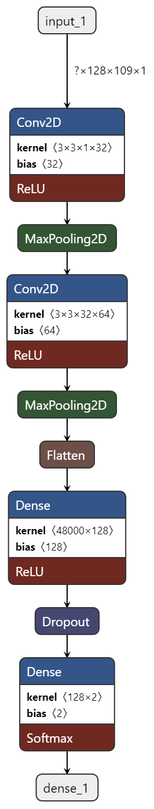
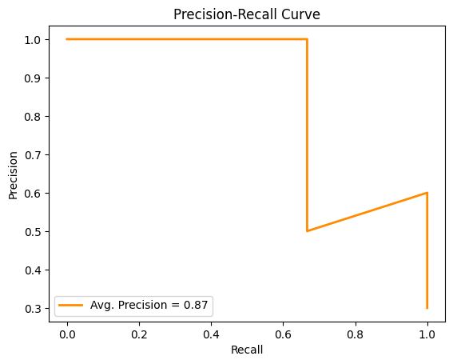
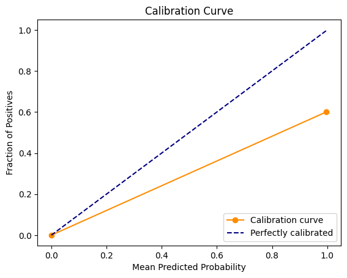
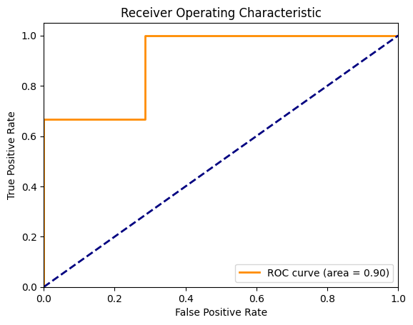

# Audio Deepfake Classification

This project focuses on building a deep learning model for classifying audio files as either genuine (bonafide) or manipulated (spoof). The objective is to detect audio deepfakes, which are manipulated audio recordings designed to impersonate a genuine audio source. The ASVspoof 2019 dataset is used for training and evaluating the model.

## Project Overview

- **Data:** ASVspoof 2019 dataset containing genuine and spoof audio recordings.
- **Preprocessing:** Convert audio files to Mel spectrograms, augment training data.
- **Model Architecture:** Convolutional Neural Network (CNN) with classification layers.
- **Training:** Binary cross-entropy loss, Adam optimizer, monitoring metrics.
- **Evaluation:** Accuracy, F1 score, ROC curve, AUC.
- **Visualization:** Model architecture visualization using `plot_model` and Netron.

## Model Architecture

The model architecture is designed to extract features from Mel spectrograms and make predictions for audio deepfake classification.

1. **Convolutional Layer:** Extracts local features from the Mel spectrogram using convolutional filters.
2. **MaxPooling Layer:** Performs downsampling to reduce spatial dimensions.
3. **Batch Normalization:** Normalizes activations to stabilize training.
4. **ReLU Activation:** Introduces non-linearity to the model.
5. **Dropout Layer:** Prevents overfitting by deactivating neurons randomly during training.
6. **Global Average Pooling Layer:** Aggregates feature maps for global information.
7. **Dense Layer:** Performs classification with a sigmoid activation function.

<div align="center">
  
</div>

## Metrics 




## Getting Started

### Installation

To use this project, follow these steps:

1. **Clone the repository:**
```bash
   git clone https://github.com/sksmta/audio-deepfake-detection.git
   cd audio-deepfake-detection
```

2. **Download the ASVspoof 2019 dataset:**

Download the dataset from [here](https://www.asvspoof.org/) and extract it into the dataset directory.

## Contribution

Contributions are welcome and greatly appreciated. To contribute to this project, follow these steps:

1. Fork the repository to your own GitHub account.

2. Clone the forked repository to your local machine:
 ```bash
   git clone https://github.com/sksmta/audio-deepfake-detection.git
   cd audio-deepfake-detection
 ```
3. **Create a new branch for your contribution:**
```bash
   git checkout -b feature/your-feature-name
```
4. Make your changes, improvements, or bug fixes.
5. **Commit your changes with a meaningful commit message:**
```bash
git commit -m "Add your commit message here"
```
6. **Push your changes to your GitHub repository:**
```bash
git push origin feature/your-feature-name
```
7. Open a pull request on the original repository's `main` branch. Provide a clear description of your contribution.
8. Your pull request will be reviewed, and any necessary feedback will be given. Once approved, your contribution will be merged into the main project.

Thank you for your valuable contributions to make this project even better!

## Acknowledgments

- ASVspoof 2019 dataset: [Download](https://www.asvspoof.org/)
- Netron: [GitHub Repository](https://github.com/lutzroeder/netron)
